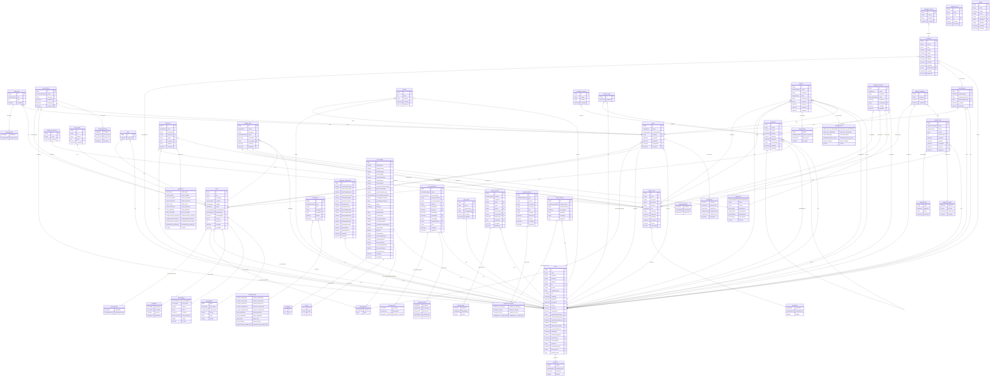

```mermaid
erDiagram

        AdminRole {
            SUPPORT SUPPORT
MODERATOR MODERATOR
ADMIN ADMIN
        }
    


        UserRole {
            USER USER
MODERATOR MODERATOR
SUPPORT SUPPORT
ADMIN ADMIN
        }
    


        ItemCondition {
            NEW NEW
LIKE_NEW LIKE_NEW
EXCELLENT EXCELLENT
GOOD GOOD
FAIR FAIR
POOR POOR
        }
    


        ItemStatus {
            AVAILABLE AVAILABLE
IN_TRADE IN_TRADE
TRADED TRADED
REMOVED REMOVED
        }
    


        ItemCategory {
            ELECTRONICS ELECTRONICS
CLOTHING CLOTHING
BOOKS BOOKS
TOYS TOYS
SPORTS SPORTS
COLLECTIBLES COLLECTIBLES
HOME HOME
OTHER OTHER
        }
    


        DeliveryMethod {
            PHYSICAL PHYSICAL
MAIL MAIL
        }
    


        DeliveryScope {
            NATIONAL NATIONAL
INTERNATIONAL INTERNATIONAL
        }
    


        TradeStatus {
            PENDING PENDING
ACCEPTED ACCEPTED
REJECTED REJECTED
COMPLETED COMPLETED
CANCELLED CANCELLED
EXPIRED EXPIRED
        }
    


        TradeItemSide {
            OFFERED OFFERED
REQUESTED REQUESTED
        }
    


        CounterOfferStatus {
            PENDING PENDING
ACCEPTED ACCEPTED
REJECTED REJECTED
EXPIRED EXPIRED
        }
    


        NotificationType {
            TRADE_PROPOSAL TRADE_PROPOSAL
TRADE_ACCEPTED TRADE_ACCEPTED
TRADE_REJECTED TRADE_REJECTED
TRADE_CANCELLED TRADE_CANCELLED
TRADE_COMPLETED TRADE_COMPLETED
NEW_MESSAGE NEW_MESSAGE
NEW_COMMENT NEW_COMMENT
NEW_LIKE NEW_LIKE
NEW_REVIEW NEW_REVIEW
VERIFICATION_SUBMITTED VERIFICATION_SUBMITTED
        }
    


        Theme {
            LIGHT LIGHT
DARK DARK
AUTO AUTO
        }
    


        Language {
            EN EN
RO RO
        }
    


        DisputeStatus {
            OPEN OPEN
UNDER_REVIEW UNDER_REVIEW
RESOLVED RESOLVED
CLOSED CLOSED
        }
    


        DisputeReason {
            ITEM_NOT_AS_DESCRIBED ITEM_NOT_AS_DESCRIBED
ITEM_NOT_RECEIVED ITEM_NOT_RECEIVED
ITEM_DAMAGED ITEM_DAMAGED
COMMUNICATION_ISSUE COMMUNICATION_ISSUE
SCAM_ATTEMPT SCAM_ATTEMPT
OTHER OTHER
        }
    


        VerificationStatus {
            PENDING PENDING
APPROVED APPROVED
REJECTED REJECTED
UNDERAGE UNDERAGE
CANCELLED CANCELLED
        }
    


        DocumentType {
            ID_CARD ID_CARD
PASSPORT PASSPORT
DRIVERS_LICENSE DRIVERS_LICENSE
        }
    


        AuditAction {
            USER_BAN USER_BAN
USER_UNBAN USER_UNBAN
USER_SUSPEND USER_SUSPEND
USER_ACTIVATE USER_ACTIVATE
ITEM_FLAG ITEM_FLAG
ITEM_APPROVE ITEM_APPROVE
ITEM_REMOVE ITEM_REMOVE
ROLE_CHANGE ROLE_CHANGE
VERIFICATION_APPROVE VERIFICATION_APPROVE
VERIFICATION_REJECT VERIFICATION_REJECT
MODERATION_APPROVE MODERATION_APPROVE
MODERATION_REMOVE MODERATION_REMOVE
OTHER OTHER
        }
    


        FlagReason {
            INAPPROPRIATE INAPPROPRIATE
SPAM SPAM
SCAM SCAM
DUPLICATE DUPLICATE
PROHIBITED PROHIBITED
MISLEADING MISLEADING
COPYRIGHT COPYRIGHT
OTHER OTHER
        }
    


        ModerationStatus {
            PENDING PENDING
APPROVED APPROVED
REMOVED REMOVED
        }
    


        SupportChatStatus {
            WAITING WAITING
ACTIVE ACTIVE
RESOLVED RESOLVED
CLOSED CLOSED
        }
    


        SupportPriority {
            LOW LOW
MEDIUM MEDIUM
HIGH HIGH
CRITICAL CRITICAL
        }
    


        OAuthProvider {
            GOOGLE GOOGLE
FACEBOOK FACEBOOK
APPLE APPLE
        }
    


        LegalDocumentType {
            TERMS_OF_SERVICE TERMS_OF_SERVICE
PRIVACY_POLICY PRIVACY_POLICY
COOKIE_POLICY COOKIE_POLICY
COMMUNITY_GUIDELINES COMMUNITY_GUIDELINES
        }
    
  "users" {
    String id "🗝️"
    String email 
    String username 
    String password 
    String avatarUrl "❓"
    String bio "❓"
    String location "❓"
    Float reputationScore 
    UserRole role 
    DateTime createdAt 
    DateTime updatedAt 
    DateTime lastLoginAt "❓"
    Boolean isActive 
    Boolean isVerified 
    Boolean emailVerified 
    String emailVerificationToken "❓"
    DateTime emailVerificationExpires "❓"
    DateTime emailVerificationSentAt "❓"
    Boolean mfaEnabled 
    DateTime deletionRequestedAt "❓"
    DateTime scheduledDeletionAt "❓"
    DateTime dateOfBirth "❓"
    Boolean selfDeclaredAge18 
    DateTime ageVerifiedAt "❓"
    DateTime tosAcceptedAt "❓"
    String tosVersion "❓"
    DateTime privacyAcceptedAt "❓"
    String privacyVersion "❓"
    Json cookieConsent "❓"
    }
  

  "admin_users" {
    String id "🗝️"
    String email 
    String username 
    String password 
    String avatarUrl "❓"
    AdminRole role 
    String createdBy "❓"
    DateTime createdAt 
    DateTime updatedAt 
    DateTime lastLoginAt "❓"
    Boolean isActive 
    Boolean mfaEnabled 
    }
  

  "admin_mfa_secrets" {
    String id "🗝️"
    String secret 
    DateTime createdAt 
    }
  

  "items" {
    String id "🗝️"
    String title 
    String description 
    ItemCondition condition 
    ItemCategory category 
    ItemStatus status 
    DeliveryMethod deliveryMethods 
    DeliveryScope deliveryScope 
    Decimal estimatedValue "❓"
    String currency 
    Int viewCount 
    DateTime createdAt 
    DateTime updatedAt 
    }
  

  "item_images" {
    String id "🗝️"
    String url 
    String publicId 
    Int order 
    DateTime createdAt 
    }
  

  "trades" {
    String id "🗝️"
    TradeStatus status 
    DeliveryMethod deliveryMethod 
    String message "❓"
    DateTime createdAt 
    DateTime updatedAt 
    DateTime completedAt "❓"
    DateTime expiresAt "❓"
    }
  

  "trade_items" {
    String id "🗝️"
    TradeItemSide side 
    Int order 
    DateTime createdAt 
    }
  

  "counter_offers" {
    String id "🗝️"
    CounterOfferStatus status 
    String message "❓"
    DateTime createdAt 
    DateTime updatedAt 
    DateTime expiresAt "❓"
    }
  

  "conversations" {
    String id "🗝️"
    DateTime lastMessageAt "❓"
    String lastMessageContent "❓"
    String lastMessageSender "❓"
    DateTime createdAt 
    DateTime updatedAt 
    }
  

  "messages" {
    String id "🗝️"
    String content 
    String type 
    Boolean isRead 
    DateTime readAt "❓"
    Boolean isEdited 
    DateTime editedAt "❓"
    Boolean isDeleted 
    DateTime deletedAt "❓"
    String deleteReason "❓"
    DateTime createdAt 
    DateTime updatedAt 
    }
  

  "message_versions" {
    String id "🗝️"
    String content 
    String editedBy 
    DateTime createdAt 
    }
  

  "reviews" {
    String id "🗝️"
    Int rating 
    String comment "❓"
    DateTime createdAt 
    DateTime updatedAt 
    }
  

  "likes" {
    String id "🗝️"
    DateTime createdAt 
    }
  

  "comments" {
    String id "🗝️"
    String content 
    Boolean isEdited 
    DateTime editedAt "❓"
    Boolean isDeleted 
    DateTime deletedAt "❓"
    String deleteReason "❓"
    DateTime createdAt 
    DateTime updatedAt 
    }
  

  "comment_versions" {
    String id "🗝️"
    String content 
    String editedBy 
    DateTime createdAt 
    }
  

  "comment_likes" {
    String id "🗝️"
    DateTime createdAt 
    }
  

  "notifications" {
    String id "🗝️"
    NotificationType type 
    String title 
    String message 
    Json metadata "❓"
    Boolean isRead 
    DateTime createdAt 
    }
  

  "notification_preferences" {
    String id "🗝️"
    Boolean emailTradeProposal 
    Boolean emailTradeAccepted 
    Boolean emailTradeRejected 
    Boolean emailTradeCancelled 
    Boolean emailNewMessage 
    Boolean emailNewComment 
    Boolean emailNewLike 
    Boolean emailNewReview 
    Boolean pushTradeProposal 
    Boolean pushTradeAccepted 
    Boolean pushTradeRejected 
    Boolean pushTradeCancelled 
    Boolean pushNewMessage 
    Boolean pushNewComment 
    Boolean pushNewLike 
    Boolean pushNewReview 
    DateTime createdAt 
    DateTime updatedAt 
    }
  

  "user_settings" {
    String id "🗝️"
    Boolean displayEmail 
    Boolean displayLocation 
    Boolean allowMessages 
    String profileVisibility 
    Boolean showTradeHistory 
    Boolean showReviews 
    Boolean showStatistics 
    Boolean autoDeclineExpiredTrades 
    Boolean allowCounterOffers 
    Boolean requireTradeMessage 
    DeliveryMethod preferredDeliveryMethod 
    String emailDigestFrequency 
    String pushDigestFrequency 
    Theme theme 
    Language language 
    Int itemsPerPage 
    String defaultSortBy 
    Boolean compactView 
    Boolean saveSearchHistory 
    Boolean showSimilarItems 
    Boolean enableRecommendations 
    Boolean highContrast 
    Boolean largeText 
    Boolean reduceMotion 
    Boolean screenReaderMode 
    Boolean marketingEmails 
    Boolean productUpdates 
    Boolean communityNewsletter 
    Boolean twoFactorEnabled 
    Int sessionTimeout 
    DateTime createdAt 
    DateTime updatedAt 
    }
  

  "disputes" {
    String id "🗝️"
    DisputeReason reason 
    String description 
    DisputeStatus status 
    String adminNotes "❓"
    String resolution "❓"
    DateTime resolvedAt "❓"
    DateTime createdAt 
    DateTime updatedAt 
    }
  

  "user_verifications" {
    String id "🗝️"
    VerificationStatus status 
    DocumentType documentType 
    String documentUrlFront 
    String documentUrlBack "❓"
    String selfieUrl 
    DateTime dateOfBirth "❓"
    Boolean isOver18 "❓"
    DateTime submittedAt 
    DateTime reviewedAt "❓"
    String reviewedBy "❓"
    String rejectionReason "❓"
    String notes "❓"
    DateTime createdAt 
    DateTime updatedAt 
    }
  

  "audit_logs" {
    String id "🗝️"
    AuditAction action 
    String description 
    String targetType "❓"
    String targetId "❓"
    Json metadata "❓"
    String ipAddress "❓"
    DateTime createdAt 
    }
  

  "flagged_items" {
    String id "🗝️"
    FlagReason reason 
    String description "❓"
    ModerationStatus status 
    DateTime reviewedAt "❓"
    String reviewNotes "❓"
    DateTime createdAt 
    DateTime updatedAt 
    }
  

  "flagged_comments" {
    String id "🗝️"
    FlagReason reason 
    String description "❓"
    ModerationStatus status 
    DateTime reviewedAt "❓"
    String reviewNotes "❓"
    DateTime createdAt 
    DateTime updatedAt 
    }
  

  "recaptcha_logs" {
    String id "🗝️"
    String action 
    Float score 
    String ip "❓"
    Boolean success 
    DateTime timestamp 
    }
  

  "support_chats" {
    String id "🗝️"
    SupportChatStatus status 
    SupportPriority priority 
    String subject 
    Int queuePosition "❓"
    DateTime createdAt 
    DateTime startedAt "❓"
    DateTime resolvedAt "❓"
    DateTime closedAt "❓"
    DateTime updatedAt 
    }
  

  "support_messages" {
    String id "🗝️"
    String message 
    Boolean isSystem 
    DateTime createdAt 
    }
  

  "mfa_secrets" {
    String id "🗝️"
    String secret 
    String backupCodes "❓"
    String recoveryEmail "❓"
    DateTime createdAt 
    DateTime updatedAt 
    }
  

  "oauth_accounts" {
    String id "🗝️"
    OAuthProvider provider 
    String providerId 
    String email "❓"
    String name "❓"
    String picture "❓"
    String accessToken "❓"
    String refreshToken "❓"
    DateTime tokenExpiry "❓"
    Json profileData "❓"
    DateTime createdAt 
    DateTime updatedAt 
    }
  

  "legal_documents" {
    String id "🗝️"
    LegalDocumentType type 
    String version 
    String contentEn 
    String contentRo 
    String title 
    String summary "❓"
    DateTime effectiveAt 
    Boolean isActive 
    DateTime createdAt 
    DateTime updatedAt 
    }
  

  "legal_consents" {
    String id "🗝️"
    LegalDocumentType documentType 
    String documentVersion 
    DateTime acceptedAt 
    String ipAddress "❓"
    String userAgent "❓"
    Json metadata "❓"
    }
  

  "waitlist" {
    String id "🗝️"
    String email 
    Boolean notified 
    String source "❓"
    String referralCode "❓"
    String userAgent "❓"
    String ipAddress "❓"
    DateTime createdAt 
    DateTime notifiedAt "❓"
    }
  
    "users" |o--|| "UserRole" : "enum:role"
    "admin_users" |o--|| "AdminRole" : "enum:role"
    "admin_mfa_secrets" |o--|| admin_users : "adminUser"
    "items" |o--|| "ItemCondition" : "enum:condition"
    "items" |o--|| "ItemCategory" : "enum:category"
    "items" |o--|| "ItemStatus" : "enum:status"
    "items" }o--|| users : "user"
    "items" |o--}o "DeliveryMethod" : "enum:deliveryMethods"
    "items" |o--|| "DeliveryScope" : "enum:deliveryScope"
    "item_images" }o--|| items : "item"
    "trades" |o--|| "TradeStatus" : "enum:status"
    "trades" }o--|| users : "proposer"
    "trades" }o--|| users : "responder"
    "trades" }o--|o items : "itemOffered"
    "trades" }o--|o items : "itemRequested"
    "trades" |o--|| "DeliveryMethod" : "enum:deliveryMethod"
    "trade_items" }o--|| trades : "trade"
    "trade_items" }o--|| items : "item"
    "trade_items" |o--|| "TradeItemSide" : "enum:side"
    "counter_offers" |o--|| "CounterOfferStatus" : "enum:status"
    "counter_offers" }o--|| trades : "trade"
    "counter_offers" }o--|| users : "createdBy"
    "counter_offers" }o--|| items : "alternativeItem"
    "conversations" }o--|| users : "user1"
    "conversations" }o--|| users : "user2"
    "conversations" |o--|o trades : "trade"
    "messages" }o--|| users : "sender"
    "messages" }o--|| conversations : "conversation"
    "messages" }o--|o users : "deletedByUser"
    "message_versions" }o--|| messages : "message"
    "reviews" }o--|| users : "author"
    "reviews" }o--|| users : "target"
    "reviews" }o--|| trades : "trade"
    "likes" }o--|| users : "user"
    "likes" }o--|| items : "item"
    "comments" }o--|| users : "user"
    "comments" }o--|| items : "item"
    "comments" |o--|o comments : "parent"
    "comments" }o--|o users : "deletedByUser"
    "comment_versions" }o--|| comments : "comment"
    "comment_likes" }o--|| users : "user"
    "comment_likes" }o--|| comments : "comment"
    "notifications" |o--|| "NotificationType" : "enum:type"
    "notifications" }o--|| users : "user"
    "notification_preferences" |o--|| users : "user"
    "user_settings" |o--|| users : "user"
    "user_settings" |o--|| "DeliveryMethod" : "enum:preferredDeliveryMethod"
    "user_settings" |o--|| "Theme" : "enum:theme"
    "user_settings" |o--|| "Language" : "enum:language"
    "disputes" }o--|| trades : "trade"
    "disputes" }o--|| users : "reporter"
    "disputes" }o--|| users : "reportedUser"
    "disputes" |o--|| "DisputeReason" : "enum:reason"
    "disputes" |o--|| "DisputeStatus" : "enum:status"
    "disputes" }o--|o admin_users : "admin"
    "disputes" }o--|o users : "user"
    "disputes" }o--|o admin_users : "adminUser"
    "user_verifications" |o--|| users : "user"
    "user_verifications" |o--|| "VerificationStatus" : "enum:status"
    "user_verifications" |o--|| "DocumentType" : "enum:documentType"
    "audit_logs" }o--|| admin_users : "performedBy"
    "audit_logs" |o--|| "AuditAction" : "enum:action"
    "audit_logs" }o--|o users : "user"
    "audit_logs" }o--|o admin_users : "adminUser"
    "flagged_items" }o--|| items : "item"
    "flagged_items" }o--|| users : "reportedBy"
    "flagged_items" |o--|| "FlagReason" : "enum:reason"
    "flagged_items" |o--|| "ModerationStatus" : "enum:status"
    "flagged_items" }o--|o admin_users : "reviewedBy"
    "flagged_comments" }o--|| comments : "comment"
    "flagged_comments" }o--|| users : "reportedBy"
    "flagged_comments" |o--|| "FlagReason" : "enum:reason"
    "flagged_comments" |o--|| "ModerationStatus" : "enum:status"
    "flagged_comments" }o--|o admin_users : "reviewedBy"
    "support_chats" }o--|| users : "user"
    "support_chats" }o--|o admin_users : "agent"
    "support_chats" |o--|| "SupportChatStatus" : "enum:status"
    "support_chats" |o--|| "SupportPriority" : "enum:priority"
    "support_messages" }o--|| support_chats : "chat"
    "support_messages" }o--|o users : "userSender"
    "support_messages" }o--|o admin_users : "adminSender"
    "mfa_secrets" |o--|| users : "user"
    "oauth_accounts" }o--|| users : "user"
    "oauth_accounts" |o--|| "OAuthProvider" : "enum:provider"
    "legal_documents" |o--|| "LegalDocumentType" : "enum:type"
    "legal_consents" }o--|| users : "user"
    "legal_consents" |o--|| "LegalDocumentType" : "enum:documentType"
```
